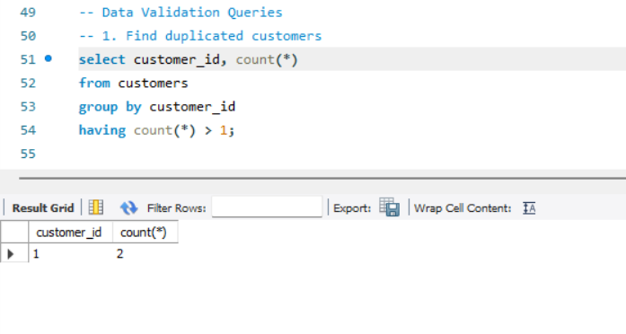
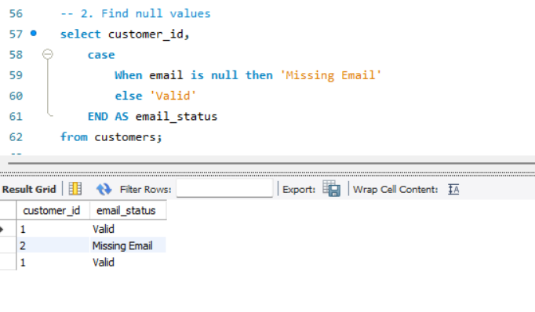
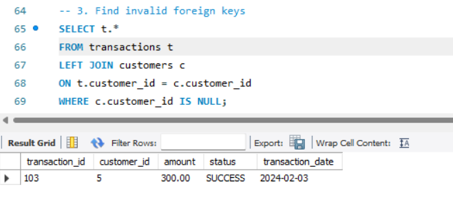
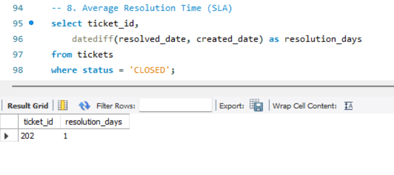
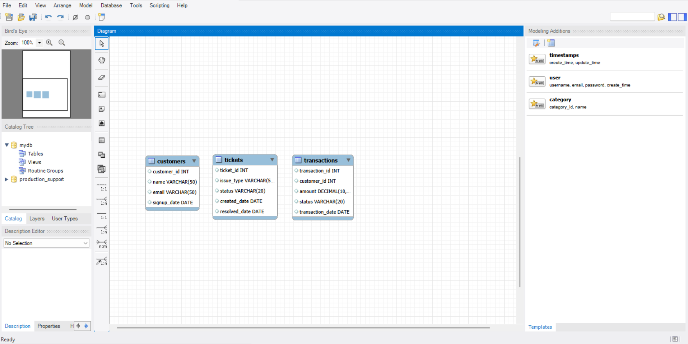

# 📊 SQL Production Support & Data Validation Project

## 🚀 Objective
This project simulates a real-world **Production Support environment** where SQL is used to:

- Detect data issues (duplicates, nulls, invalid relationships)
- Perform root cause analysis (RCA)
- Debug and resolve incidents
- Monitor SLA and ticket performance

---

## 🧠 Key Features

- Data Validation using SQL
- Incident Simulation (real support scenarios)
- SLA & Ticket Analysis
- Root Cause Analysis (RCA)

---

## 🏗️ Database Schema

The project contains 3 main tables:

- customers
- transactions
- tickets

📌 File:  
👉 [View Schema](schema.sql)

---

## 📥 Sample Data

Dataset includes **intentional issues**:

- Duplicate records  
- NULL values  
- Invalid foreign keys  

📌 File:  
👉 [View Data](data.sql)

---

## 🔍 Data Validation Queries

📌 File:  
👉 [View Data Validation  SQL Queries](validation_queries.sql)

### Includes:

- Duplicate detection  
- NULL value identification  
- Invalid foreign key detection  

---

### 📸 Sample Outputs

#### 🔁 Duplicate Detection

#### ⚠️ NULL Values

#### ❌ Invalid Foreign Keys

---

## 🛠️ Incident Scenarios

📌 File:  
👉 [View Incident Scenerios](incident_scenarios.sql)

### Scenarios Covered:

1. Incorrect Revenue Calculation  
2. Missing Customer Data  
3. Orphan Transactions  

---

## 📊 SLA & Ticket Analysis

📌 File:  
👉 [View SLA Analysis SQL](sla_analysis.sql)

### Includes:

- Resolution time calculation  
- Ticket status distribution  

#### 📸 SLA Output

---

## 🧩 ER Diagram

---

## 🧠 Key Learnings

- Identified and resolved data inconsistencies using SQL  
- Performed root cause analysis (RCA)  
- Simulated real-world production support issues  
- Improved data integrity and reporting accuracy  

---

## 🎯 Resume Description

> Built a SQL-based production support system to detect and resolve data issues including duplicates, null values, and invalid relationships. Performed root cause analysis and improved data integrity using validation queries and incident debugging techniques.

---

## ⚙️ How to Run

1. Run `schema.sql`
2. Run `data.sql`
3. Run:
   - validation_queries.sql
   - incident_scenarios.sql
   - sla_analysis.sql

---

## 👨‍💻 Author

